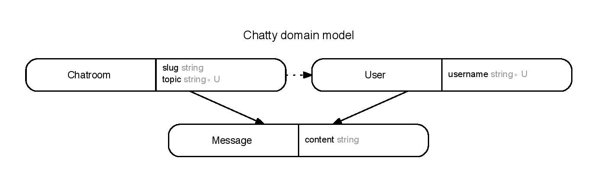

# Action Cable Chat Heroku

- This is a simple chatting app implemented with Rails 5 and Action Cable.
- Forked from:
  + [SophieDeBenedetto/action-cable-example](https://github.com/sophiedebenedetto/action-cable-example)
  +  [blog](https://blog.heroku.com/archives/2016/5/9/real_time_rails_implementing_websockets_in_rails_5_with_action_cable)
  + [demo app](https://action-cable-example.herokuapp.com)

## Features
- Users can sign up/log in with a username.
- Users can create a chatroom.
- User can choose from an existing one to start real-time messaging.

### Running Locally

You'll need:

* Ruby 2.3.0
* Postgres
* Redis

Then, once you clone down this repo:

* `bundle install`
* `rake db:create; rake db:migrate`

And you're all set.

